>这篇文章主要介绍了Python、Anaconda、VScode的安装方法。
Python和Anaconda你可以只选择安装一个，但是推荐安装后者。你可以将Anaconda理解为Python的升级版（Python+一些其他的东西）。当然，你也可以将二者全部安装。
## 安装python

- 1.下载python（下面有两个途径）
    - 【[点击这里](https://www.python.org/downloads/python-381)】在Python的官网进行下载。注意，这条链接的Python版本是3.8.1,你也可以安装其他的版本，但最好确保版本是3.5.x以上的。
    - QQ群文件里面已经上传了一个
- 2.安装python
    - 下载完成以后，你可以看到一个后缀名为`.exe`的文件，双击运行，运行以后，你将看到下面这样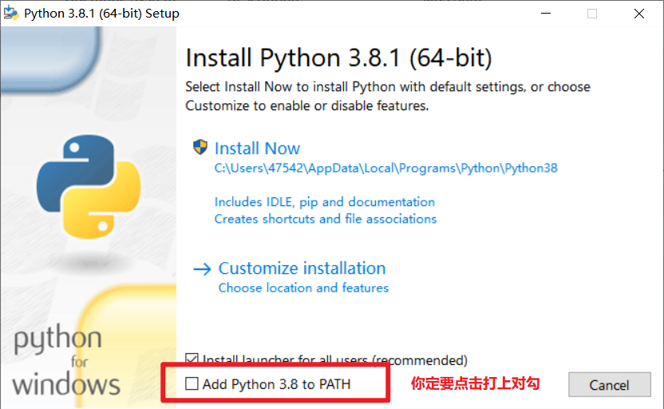，记得一定要将红色方框内的选项选中，然后点击上面蓝色箭头指向的`Customize installation`,你就会看到下面这样
    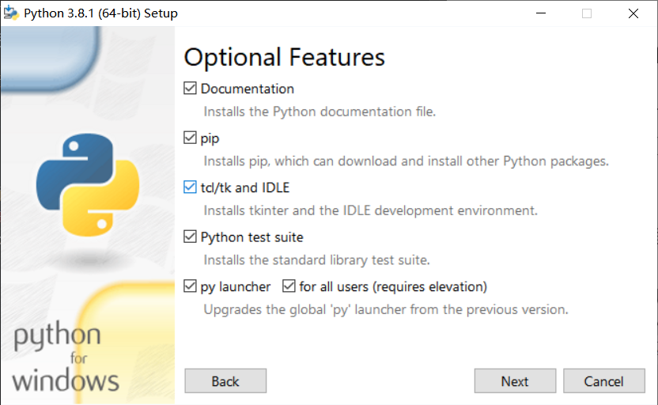在这一步里面，你只需要点击`Next`按钮进入下一步,你将看下面这样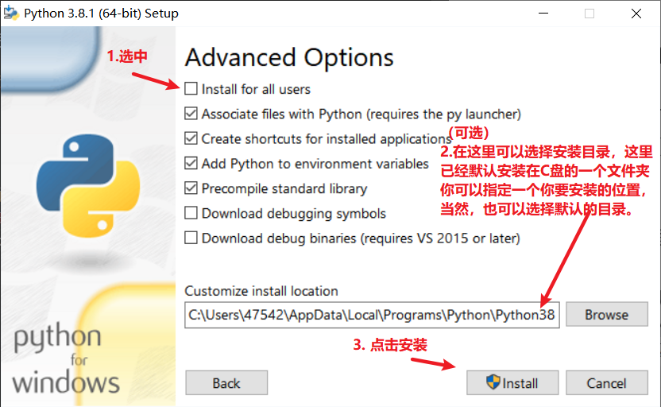,按照上面图片里的步骤进行安装就可以了，安装过程如下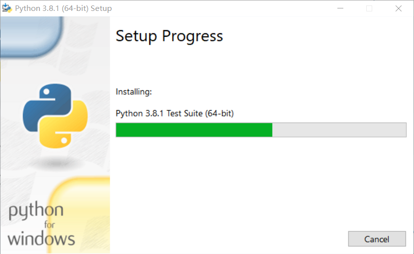进度条到头你就可以看到下面这样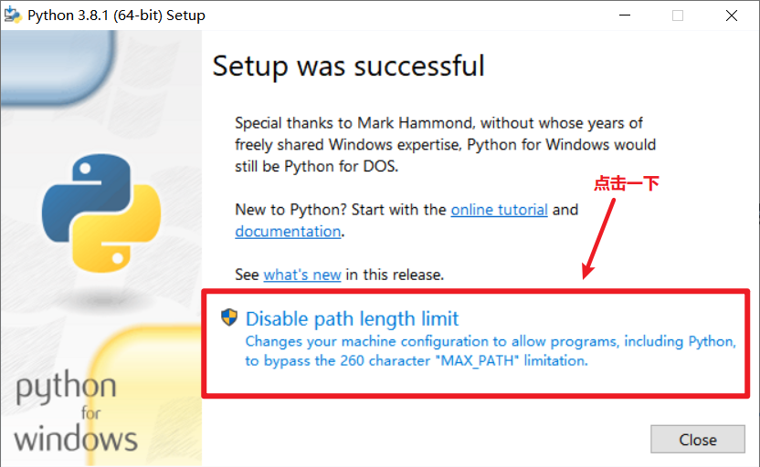点击一下红色方框内的选项，然后带你一`Close`就可以了。
- 3.我安装成功了吗？
    - 使用组合键 `windows`（就是你键盘上的那个带微软图标的键） + `R`打开运行程序，输入`cmd`，然后回车，进入命令行，输入 `python -V`，如果成功安装，你可以看到下面这样
    

## 安装Anaconda

- 1.下载Anaconda
    - 从清华大学的开源镜像站进行下载【[点击这里](https://mirrors.tuna.tsinghua.edu.cn/anaconda/archive/)】里面有好多的版本，你可以选择安装最下面的两个windows的版本，一个是32位的，一个是64位的，如果你不知道你的电脑是多少位的，你可以选择安装32位的。一般来说，新买的笔记本电脑都是64位的。
- 2.安装Anaconda
    - 和前面安装Python一样，你首先会获得一个后缀名是`.exe`的安装包，双击运行。
    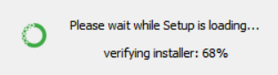
    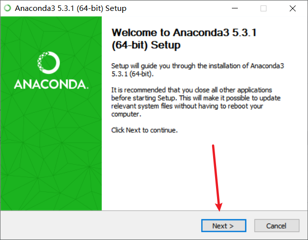
    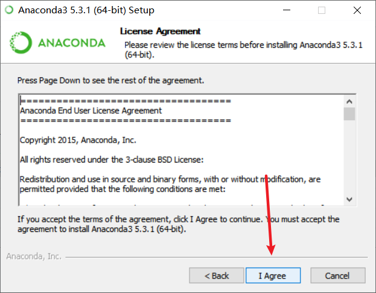
    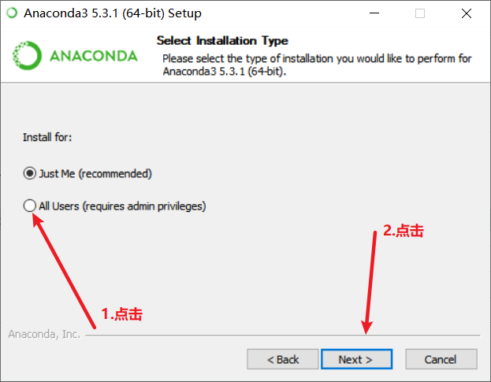
    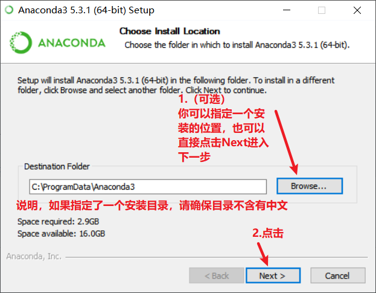
    Q:什么叫安装目录不能含有中文？
    A: 比如这样 `D:/python/安装包/` ，这里面就含有了中文
    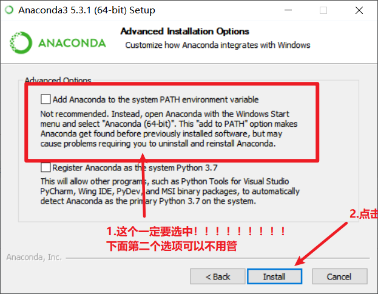
    下面这一步你可以选择跳过，点击`Skip`，因为下面就要讲VScode怎么来进行安装
    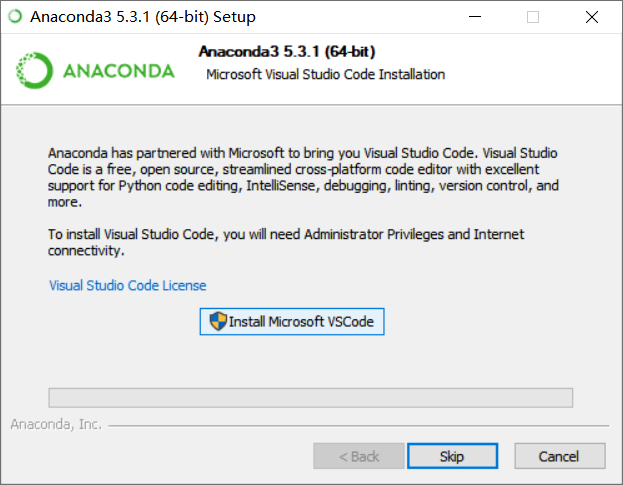
- 3.我安装成功了吗？
    - - 使用组合键 `windows`（就是你键盘上的那个带微软图标的键） + `R`打开运行程序，输入`cmd`，然后回车，进入命令行，输入 `conda -V`，如果成功安装，你可以看到下面这样
    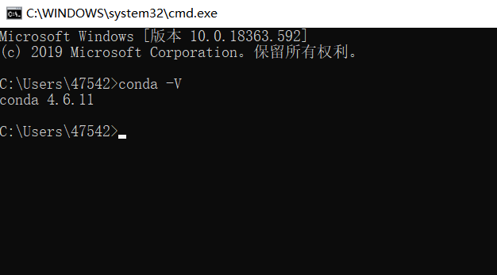

    如果你的命令行显示了上面的内容，那么恭喜你，安装成功。
    ps：我这里因为之前安装了一个anaconda，所以显示的是4.6.11版本
    

## 安装VScode
- 1.下载VScode
  -  你可以直接在它的官网进行下载【[点击这里](https://code.visualstudio.com/)】你可以下载64位的stable（稳定）版
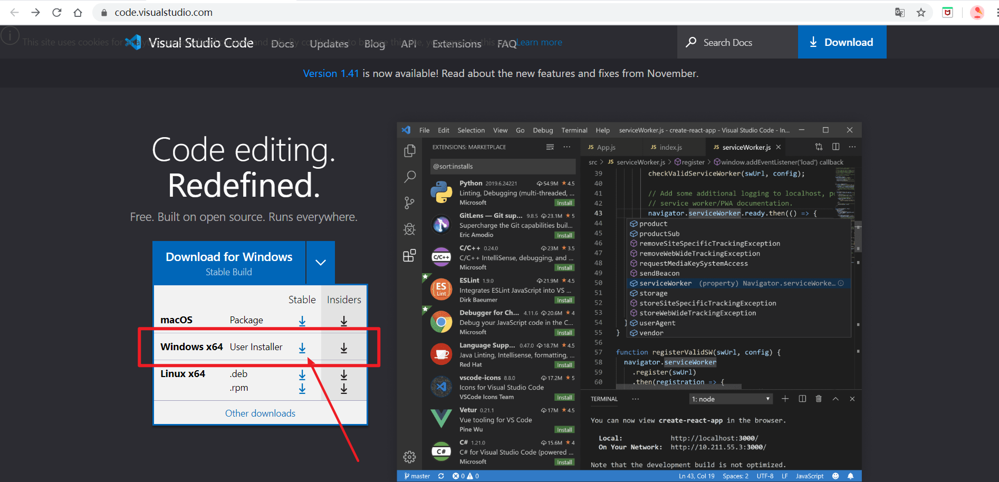
当然如果你的电脑是32位的，也可以点击下面的 `Other Downloads`选择适合的版本进行安装

- 2.安装VScode
  - 和之前一样，你会获得你个后缀名为`.exe`的安装包，双击运行。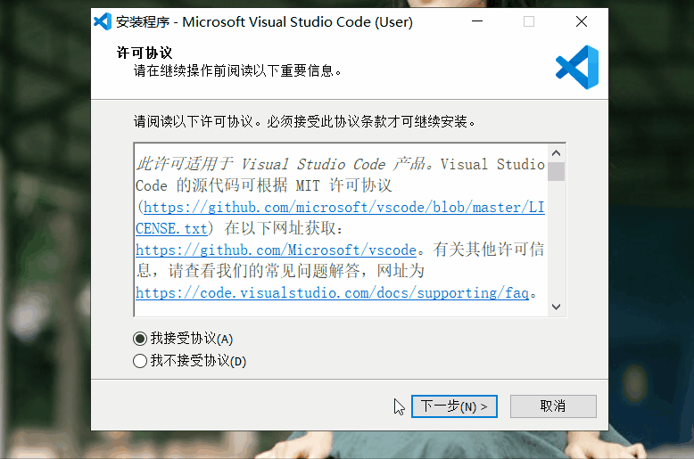

